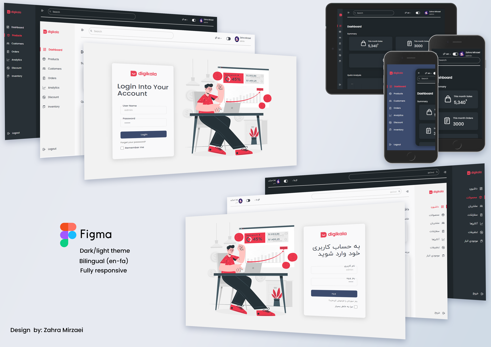

# React Admin Panel

React Admin Panel developed and build with **React (v17.0.2)**, **TypeScript (v4.4.2)** and **React Router v6**. For Styles, is used **SCSS**.
I am excited to share this dashboard with you and look forward to hearing your feedback [**my Linkedin post**](https://www.linkedin.com/posts/zahramirzaei_responsive-multilanguage-multitheme-activity-6920075757318725634-qRks?utm_source=linkedin_share&utm_medium=member_desktop_web)

# Demo

Visit: [Project React Admin Panel demo](https://admin-panel-portfolio.netlify.app/)

# Features

* Responsive layout
* Multi language
* Multi theme
* Charts(cahrtjs)
* React Hooks
* React Context
* React Router v6
* SCSS Modular
* iconify

# Pages

* Login
* Dashboard
* Products
* Edit Product
* Customers
* Edit Customers
* 404 Error(not found)

# Getting Started

**1. Clone from Github**

`git clone https://github.com/ZahraMirzaei/admin-panel.git`

**2. Run `npm install` or `yarn install`**

This will install both run-time project dependencies and developer tools listed in package.json file.

**3. Run `npm start` or `yarn start`**

Runs the app in the development mode.

Open http://localhost:3000 to view it in the browser. Whenever you modify any of the source files inside the /src folder, the module bundler (Webpack) will recompile   the app on the fly and refresh all the connected browsers.
      
**4. Run `npm build` or `yarn build`**

Builds the app for production to the build folder. It correctly bundles React in production mode and optimizes the build for the best performance.

The build is minified and the filenames include the hashes. Your app is ready to be deployed!

# Would you mind support me?

* Star GitHub repo
* Create pull requests, submit bugs, suggest new features or documentation updates.

